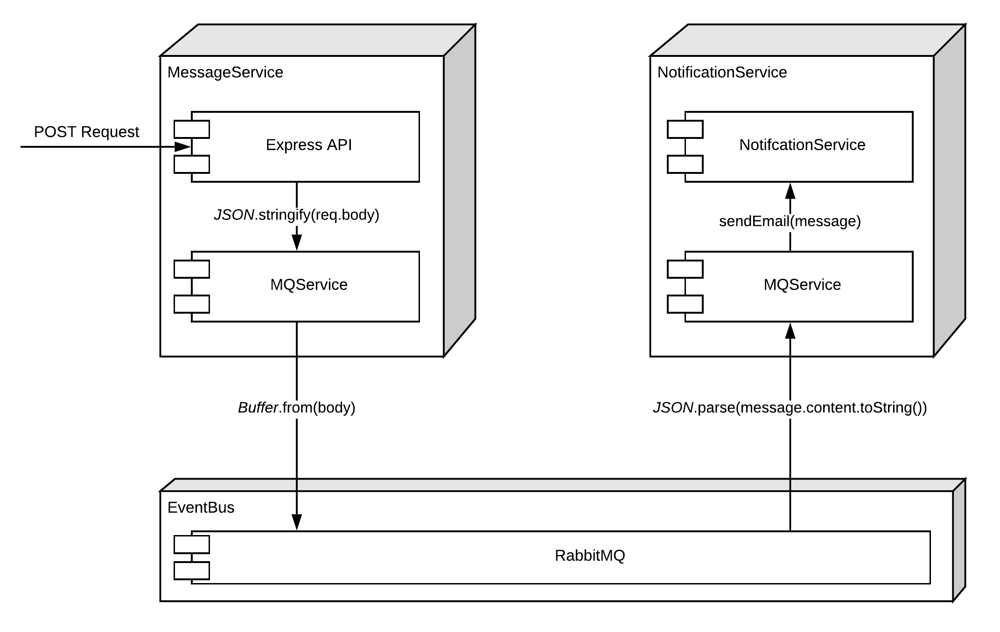

# NodeRabbit
Playing around with MQRabbit in Node.js.



## Project Installation
- Clone the project
- `yarn install`
- `node index.js` or `nodemon` in the directory of a service

## RabitMQ Installation
You can run the default configuration of RabbitMQ in Docker
```docker
docker run -it --rm --name rabbitmq -p 5672:5672 -p 15672:15672 rabbitmq:3-management
```